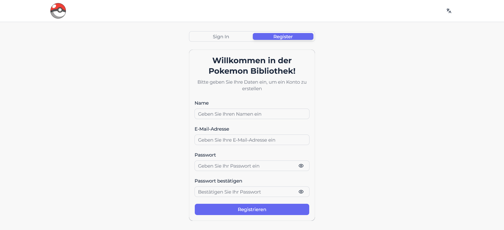
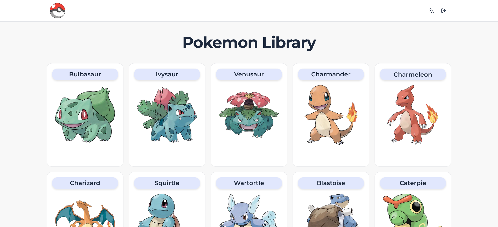
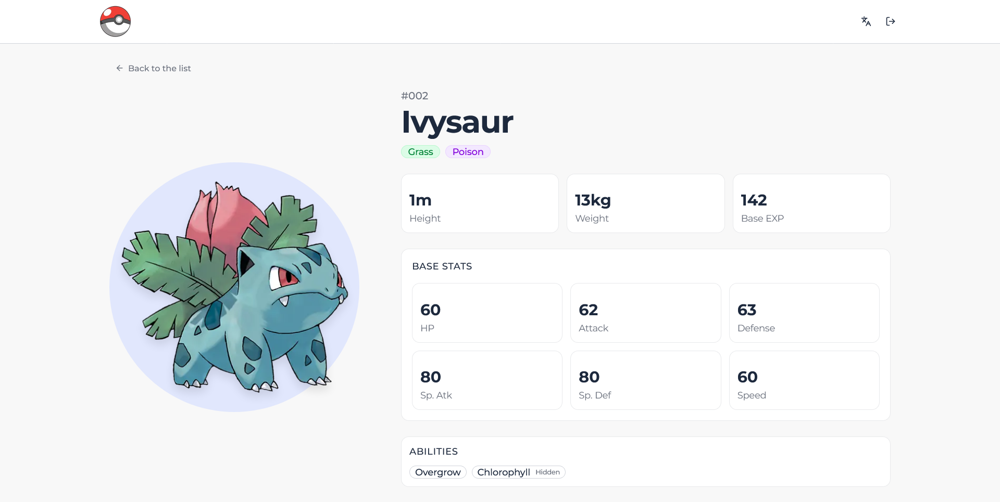

# Pokémon Library

A modern Pokémon library web application built with Next.js App Router. It provides a responsive UI to browse Pokémon, view detailed information, and interact with localized content.

## Tech Stack

- **Framework**: Next.js 15 (App Router, TypeScript)
- **Language**: TypeScript
- **Styling**: Tailwind CSS, Shadcn UI
- **State Management**: Zustand
- **Forms & Validation**: React Hook Form, Zod
- **Data Fetching**: Tanstack Query
- **Internationalization**: next-intl
- **Testing**: Playwright
- **Linting**: ESLint

## Getting Started

### Prerequisites

- Node.js
- npm or pnpm/yarn

### Installation & Development Server

```bash
npm install
npm run dev
```

The app will be available at `http://localhost:3000`.

## Running Tests (Playwright)

Make sure the development server is running (`npm run dev`), then in another terminal run:

```bash
npx playwright test
```

## Deployment

The application is deployed at [Vercel](https://pokemon-library-five.vercel.app/)

## Screenshots

### Auth Page (German)



### Pokémon List (English)



### Pokémon Detail (English)


